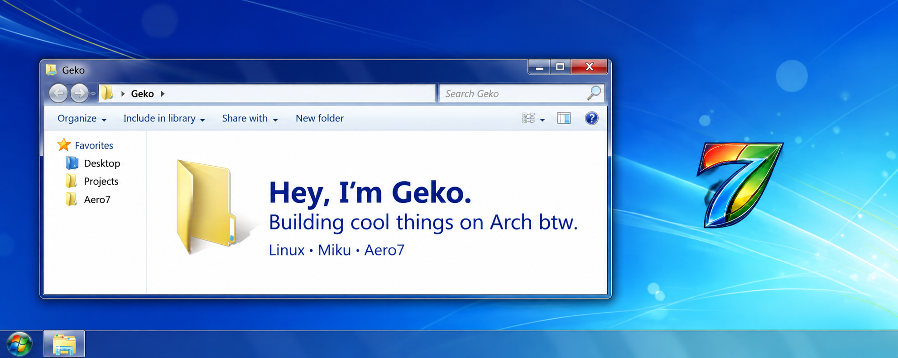
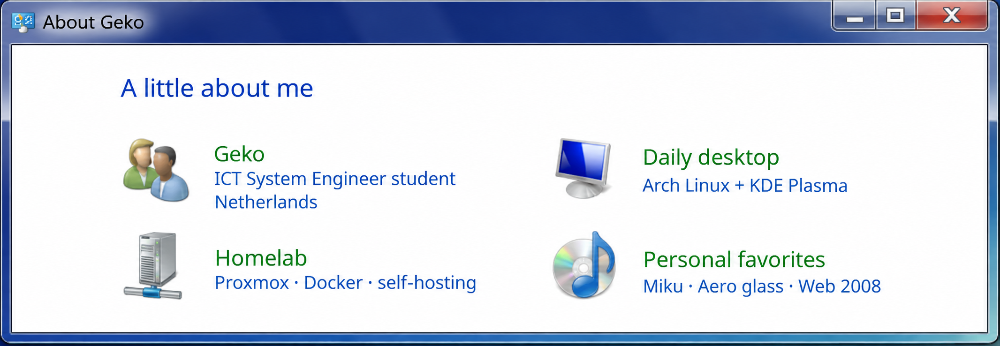
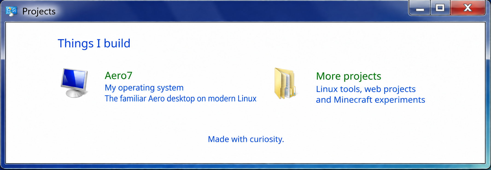

  

  <b>Welcome to my little corner of the internet.</b> 
  A few open windows into what I build, what I run, and where to find me.

  <b>There is always another project open.</b> 
  I like making useful things feel familiar, with a little personality along the way.

  <a href="https://aero7.miku-dayo.com/">Aero7 — my OS</a> &nbsp;·&nbsp;
  <a href="https://github.com/aero7-open-project">Aero7 source code</a> &nbsp;·&nbsp;
  <a href="https://github.com/memegeko?tab=repositories">All projects</a>

  <b>Leave a window open.</b> 
  Have an idea, a question, or just want to say hi? You can find me below.

  <a href="https://geko.miku-dayo.com/">My website</a> &nbsp;·&nbsp;
  <a href="mailto:geko@miku-dayo.com">Email</a> &nbsp;·&nbsp;
  <a href="https://discord.com/users/838354851099312138">Discord</a> &nbsp;·&nbsp;
  <a href="https://steamcommunity.com/id/Meme_geko/">Steam</a> &nbsp;·&nbsp;
  <a href="https://www.tiktok.com/@geko.ofc">TikTok</a>

